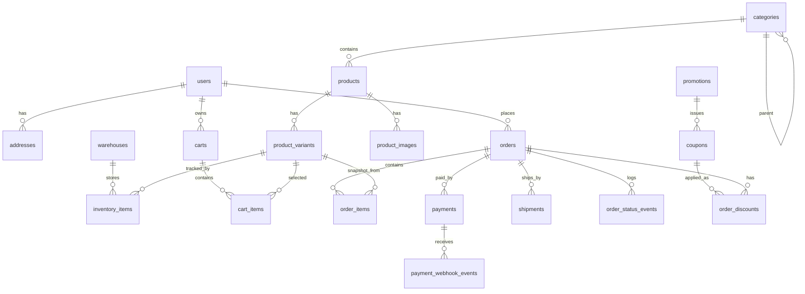

# Database ERD

## Design Notes

- UUID primary keys are generated with `gen_random_uuid()` from `pgcrypto`.
- Money values are stored as integer minor units, such as satang for THB.
- Order items store product, variant, SKU, option, and price snapshots.
- Inventory uses `on_hand`, `reserved`, and `safety_stock`; availability is `on_hand - reserved - safety_stock`.
- Stock reservation code locks `inventory_items` with `select ... for update`.
- Payment webhooks are idempotent through unique `(provider, event_id)`.
- Promotions and coupons have separate usage counters and usage limits.
